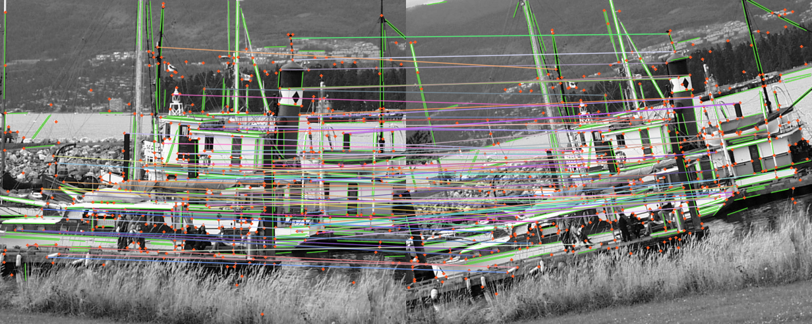

<p align="center">
  <h1 align="center">UPAL: Unified and Efficient Point-Line Local Features - ECCV 2026</h1>
  <p align="center">
    François Costa
    · Raphael Kreft
    · Eckhard Goedeke
    · Felix Möller
    · Hardik Shah
    · Ramanathan Rajaraman
    · Shaohui Liu
    · Rémi Pautrat
    · Marc Pollefeys
  </p>

  <h2 align="center"><a href="https://example.com">Paper</a></h2>
  <p align="center">
    
    <br>
    <em>Red dots are learned keypoints, green segments are line detections supported by the learned distance field, and colored links are mutual-nearest descriptor matches.</em>
  </p>
</p>

## Upal

Standalone PyTorch inference for **UPAL**, an ECCV 2026–accepted joint point-line detector. The repository contains the network architecture, trained weights, and runnable inference, point-matching, and line-matching examples on the classic `boat1` / `boat2` images. For every input image, UPAL predicts:

- sub-pixel keypoints and their confidence scores;
- 128-dimensional, L2-normalized local descriptors;
- a dense keypoint/junction heatmap;
- a dense line distance field.

The inference network uses an ALIKED-style multi-scale encoder, deformable convolutions in its deeper stages, a sparse deformable descriptor head, a point/junction scoring head, and a line-distance-field decoder. The demo uses the bundled `points_lsd` detector, seeded from UPAL's learned keypoints, and filters its proposals with the learned distance field.

## Installation

Python 3.10 or newer is recommended. Create an environment and install the package:

```bash
python3 -m venv .venv
source .venv/bin/activate
python3 -m pip install --upgrade pip
python3 -m pip install -e .
git submodule update --init --recursive
DEBUG=0 python3 -m pip install ./third_party/points_lsd
```

For a CUDA installation, install the matching PyTorch build from [pytorch.org](https://pytorch.org/get-started/locally/) before running the last command.

## Run the demos

From the repository root, run inference on one image and save its feature overlay:

```bash
python demo_inference.py
```

Match learned point descriptors across an image pair:

```bash
python demo_match_points.py
```

Match field-supported line segments across the same pair:

```bash
python demo_match_lines.py
```

The scripts write `outputs/inference.png`, `outputs/point_matches.png`, and `outputs/line_matches.png`, respectively. CPU inference is supported; CUDA is selected automatically when available. The line matcher extracts descriptors at the two endpoints of each detected segment, scores both endpoint orientations, and solves a one-to-one line assignment.

Useful options:

```bash
python demo_match_points.py \
  --image0 path/to/first.jpg \
  --image1 path/to/second.jpg \
  --device cuda \
  --max-size 800 \
  --max-keypoints 1500 \
  --output outputs/my_pair.png
```

## Python API

```python
import cv2
import torch

from upal import load_model

device = "cuda" if torch.cuda.is_available() else "cpu"
model = load_model(
    "weights/upal.tar",
    device=device,
    max_num_keypoints=1024,
)

image = cv2.cvtColor(cv2.imread("assets/boat1.png"), cv2.COLOR_BGR2RGB)
image = torch.from_numpy(image.copy()).permute(2, 0, 1).float() / 255.0

with torch.inference_mode():
    prediction = model(image.unsqueeze(0).to(device))

print(prediction["keypoints"].shape)            # [1, N, 2], pixel (x, y)
print(prediction["descriptors"].shape)          # [1, N, 128]
print(prediction["keypoint_scores"].shape)      # [1, N]
print(prediction["keypoint_heatmap"].shape)     # [1, H, W]
print(prediction["line_distance_field"].shape)  # [1, H, W], pixels
```

Input tensors must be `B x 3 x H x W` or `B x 1 x H x W`, with values in `[0, 1]`. Padding to a multiple of 32 is handled internally and removed from every output.


## BibTeX

TODO: Add citation

## Acknowledgments

Parts of this codebase reuse code from [ALIKED](https://github.com/Shiaoming/ALIKED) and [glue-factory](https://github.com/cvg/glue-factory); we thank their authors for making it available. We also thank the authors of [SuperPoint](https://github.com/magicleap/SuperPointPretrainedNetwork), [ALIKED](https://github.com/Shiaoming/ALIKED), [DaD](https://github.com/daniela-b/DaD), and [DeepLSD](https://github.com/cvg/DeepLSD) for releasing their pre-trained models, which we use as teachers.
